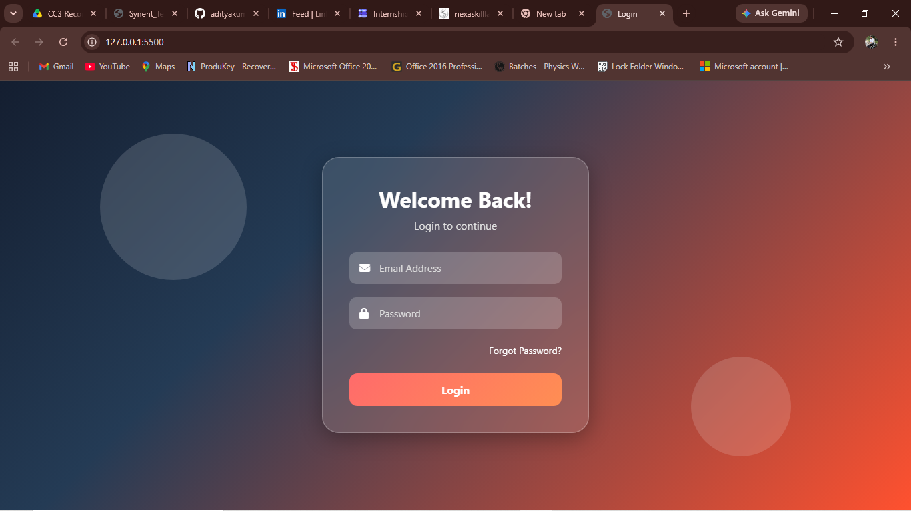

# Login Page

## 📌 Project Overview

The **Login Page** is a frontend web development project built using **HTML5** and **CSS3**. The objective of this project is to create a visually appealing, responsive, and user-friendly authentication interface while implementing modern UI/UX design principles.

This project demonstrates the practical implementation of responsive web design, Glassmorphism effects, CSS animations, gradient backgrounds, and interactive user interface components.

---

## 🎯 Project Objectives

* Design a modern and attractive login page.
* Create a responsive interface compatible with various screen sizes.
* Implement Glassmorphism design trends.
* Enhance user experience through animations and visual feedback.
* Practice frontend development concepts using HTML and CSS.

---

## 🛠️ Technologies Used

| Technology   | Purpose                          |
| ------------ | -------------------------------- |
| HTML5        | Structure of the webpage         |
| CSS3         | Styling and responsiveness       |
| Font Awesome | Icons for input fields           |
| Flexbox      | Layout alignment and positioning |

---

## ✨ Features

### 🔹 Modern User Interface

* Clean and professional login form.
* Attractive visual hierarchy.
* User-friendly design.

### 🔹 Glassmorphism Design

* Semi-transparent login card.
* Blur effects using `backdrop-filter`.
* Frosted glass appearance.

### 🔹 Gradient Background

* Modern multi-color gradient.
* Improved visual aesthetics.
* Enhanced user engagement.

### 🔹 Responsive Design

* Optimized for:

  * Desktop Devices
  * Laptops
  * Tablets
  * Mobile Phones

### 🔹 Interactive Components

* Hover effects on buttons.
* Focus effects on input fields.
* Smooth CSS transitions.

### 🔹 Icon Integration

* Email icon.
* Password icon.
* Improved usability.

---

## 📂 Project Structure

```text
Login-Page-UI/
│
├── index.html
├── style.css
├── README.md
└── screenshots/
```

---

## ⚙️ Methodology

### Step 1: Planning

The project requirements were analyzed to determine:

* Required input fields.
* Layout structure.
* User experience considerations.
* Responsive behavior.

### Step 2: HTML Development

The webpage structure was created using semantic HTML elements:

* Login Container
* Email Input Field
* Password Input Field
* Forgot Password Link
* Login Button

### Step 3: CSS Styling

The interface was styled using:

* Flexbox Layout
* Glassmorphism Effects
* Gradient Backgrounds
* Border Radius
* Shadows
* Responsive Media Queries

### Step 4: Responsiveness

Media queries were implemented to ensure:

* Proper scaling on small devices.
* Flexible layout adaptation.
* Improved mobile usability.

### Step 5: UI Enhancement

Additional visual improvements included:

* Floating background elements.
* Hover animations.
* Input focus effects.
* Smooth transitions.

---

## 🧩 Design Components

### Login Card

The login card serves as the central component of the interface.

Features:

* Glassmorphism effect.
* Rounded corners.
* Transparent background.
* Blur effect.
* Shadow effects.

### Input Fields

Each input field includes:

* Placeholder text.
* Icon integration.
* Focus state styling.
* Responsive width.

### Login Button

Features:

* Gradient styling.
* Hover animations.
* Shadow effects.
* Smooth transitions.

---

## 📱 Responsiveness Report

| Device Type | Status             |
| ----------- | ------------------ |
| Desktop     | ✅ Fully Responsive |
| Laptop      | ✅ Fully Responsive |
| Tablet      | ✅ Fully Responsive |
| Mobile      | ✅ Fully Responsive |

Implemented using CSS Media Queries:

```css
@media (max-width:768px)
@media (max-width:480px)
```

---

## 📊 Learning Outcomes

Through this project, the following concepts were learned and strengthened:

* HTML5 Fundamentals
* CSS3 Styling Techniques
* Flexbox Layout System
* Responsive Web Design
* Glassmorphism Design
* CSS Animations
* UI/UX Best Practices
* Frontend Development Workflow

---

## 📸 Screenshots



---

## 📈 Conclusion

The Responsive Login Page successfully achieves its objective of creating an attractive, responsive, and user-friendly authentication interface. The project demonstrates practical frontend development skills and showcases modern UI design techniques such as Glassmorphism, responsive layouts, and interactive user experiences.

This project serves as a strong foundation for future web application development and frontend engineering practices.

---